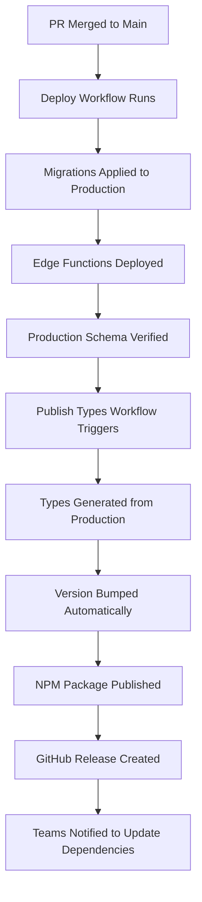

# Database Schema Changes Guide

This guide covers the complete workflow for making database schema changes in the EverlyLanguage backend, from local development to automatic NPM package publishing.

## 🎯 Overview

When you make database schema changes, this triggers an automated pipeline that:

1. ✅ **Validates** your changes through CI/CD
2. 🚀 **Deploys** migrations to production
3. 📦 **Publishes** updated TypeScript types to NPM
4. 🏷️ **Creates** GitHub releases with version tracking

## 🔄 Complete Workflow

### Step 1: Local Development

```bash
# 1. Create a new migration
supabase migration new add_audio_segments_table

# 2. Edit the migration file
# File created: supabase/migrations/20241201123456_add_audio_segments_table.sql
```

**Example Migration:**

```sql
-- Add audio segments table for storing individual audio chunks
CREATE TABLE audio_segments (
    id UUID DEFAULT gen_random_uuid() PRIMARY KEY,
    recording_id UUID REFERENCES recordings(id) ON DELETE CASCADE,
    start_time_ms INTEGER NOT NULL,
    end_time_ms INTEGER NOT NULL,
    text_content TEXT,
    translated_text TEXT,
    language_code VARCHAR(10) NOT NULL,
    confidence_score DECIMAL(3,2),
    created_at TIMESTAMP WITH TIME ZONE DEFAULT NOW(),
    updated_at TIMESTAMP WITH TIME ZONE DEFAULT NOW()
);

-- Add RLS policies
ALTER TABLE audio_segments ENABLE ROW LEVEL SECURITY;

CREATE POLICY "Users can view audio segments from their recordings"
    ON audio_segments FOR SELECT
    USING (
        recording_id IN (
            SELECT id FROM recordings WHERE user_id = auth.uid()
        )
    );

-- Add indexes for performance
CREATE INDEX idx_audio_segments_recording_id ON audio_segments(recording_id);
CREATE INDEX idx_audio_segments_language ON audio_segments(language_code);
```

### Step 2: Test Locally

```bash
# Apply migration to local database
npm run migrate

# Generate updated types
npm run generate-types

# Verify types look correct
cat types/database.ts

# Test with your application code
npm test

# Check Supabase Studio
# Visit: http://127.0.0.1:54323
```

### Step 3: Commit Changes

```bash
# Add migration and types
git add supabase/migrations/ types/database.ts

# Use conventional commits for proper versioning
npm run commit

# Choose commit type based on impact:
# - feat: new table/columns → Minor version bump (1.1.0)
# - fix: bug fixes → Patch version bump (1.0.1)
# - feat!: breaking changes → Major version bump (2.0.0)
```

**Example Commit Messages:**

```bash
# For new features (minor bump)
feat: add audio_segments table for chunked audio processing

# For breaking changes (major bump)
feat!: restructure user_profiles table with breaking changes
# or
feat: add new required column to recordings table

BREAKING CHANGE: recordings table now requires language_code field

# For fixes (patch bump)
fix: add missing index on recordings.created_at
```

### Step 4: Create Pull Request

```bash
# Push your feature branch
git push origin feature/add-audio-segments

# Create PR on GitHub
# CI will automatically run and validate your changes
```

**What CI Tests:**

- ✅ Migration syntax and logic
- ✅ RLS policies are present
- ✅ Types generation works
- ✅ No conflicts with existing schema
- ✅ Code quality checks

### Step 5: Merge and Automatic Deployment

Once your PR is approved and merged:



## 📦 NPM Package Publishing

### Automatic Publishing

The system automatically:

1. **Detects Changes**: Compares new types with published version
2. **Bumps Version**: Based on your conventional commit messages
3. **Publishes Package**: `@everylanguage/shared-types` to NPM
4. **Creates Release**: GitHub release with changelog

### Version Bumping Rules

| Commit Pattern                 | Version Bump      | Example                             |
| ------------------------------ | ----------------- | ----------------------------------- |
| `feat:`                        | **Minor** (1.1.0) | New tables, columns, functions      |
| `fix:`                         | **Patch** (1.0.1) | Bug fixes, performance improvements |
| `feat!:` or `BREAKING CHANGE:` | **Major** (2.0.0) | Breaking schema changes             |

### Manual Publishing

If you need to publish manually:

```bash
# Go to GitHub Actions → "Publish Types Package"
# Click "Run workflow"
# Choose version bump type (patch/minor/major)
# Click "Run workflow"
```

## 🏗️ Schema Design Best Practices

### Table Naming

- Use `snake_case` for table and column names
- Use descriptive, plural table names: `audio_segments`, `user_profiles`
- Include clear foreign key relationships

### Required Elements

Always include these in new tables:

```sql
CREATE TABLE example_table (
    -- Primary key
    id UUID DEFAULT gen_random_uuid() PRIMARY KEY,

    -- Foreign keys with proper constraints
    user_id UUID REFERENCES profiles(id) ON DELETE CASCADE,

    -- Timestamps
    created_at TIMESTAMP WITH TIME ZONE DEFAULT NOW(),
    updated_at TIMESTAMP WITH TIME ZONE DEFAULT NOW(),

    -- Your columns...
    name TEXT NOT NULL,
    description TEXT
);

-- Enable RLS
ALTER TABLE example_table ENABLE ROW LEVEL SECURITY;

-- Add policies
CREATE POLICY "policy_name" ON example_table
    FOR SELECT USING (user_id = auth.uid());

-- Add useful indexes
CREATE INDEX idx_example_table_user_id ON example_table(user_id);
CREATE INDEX idx_example_table_created_at ON example_table(created_at);
```

### RLS Policies

Always add Row Level Security policies:

```sql
-- Read access
CREATE POLICY "Users can view their own records"
    ON table_name FOR SELECT
    USING (user_id = auth.uid());

-- Write access
CREATE POLICY "Users can insert their own records"
    ON table_name FOR INSERT
    WITH CHECK (user_id = auth.uid());

CREATE POLICY "Users can update their own records"
    ON table_name FOR UPDATE
    USING (user_id = auth.uid())
    WITH CHECK (user_id = auth.uid());
```

## 🧪 Testing Schema Changes

### Local Testing Checklist

- [ ] Migration runs without errors
- [ ] Types generate successfully
- [ ] RLS policies work as expected
- [ ] Application code works with new schema
- [ ] Performance is acceptable (check query plans)
- [ ] Rollback strategy is clear

### Testing RLS Policies

```sql
-- Test as authenticated user
SELECT * FROM audio_segments; -- Should only see user's data

-- Test as different user
-- Should not see other users' data
```

### Testing Migration Rollback

Always have a plan to rollback:

```sql
-- In your migration, consider how to undo changes
-- Example rollback for above migration:
/*
DROP TABLE IF EXISTS audio_segments;
*/
```

## 🚨 Common Issues and Solutions

### Migration Fails in Production

```bash
# Check migration syntax locally first
supabase db reset  # Reset to clean state
npm run migrate    # Apply your migration

# If it works locally but fails in production:
# - Check for data conflicts
# - Verify foreign key constraints
# - Check existing data that might violate new constraints
```

### Types Out of Sync

```bash
# If types don't match between local and production:
npm run generate-types  # Regenerate from local
git diff types/database.ts  # See what changed

# Or generate from production:
supabase link --project-ref your-prod-ref
supabase gen types typescript > types/database-prod.ts
```

### RLS Policy Issues

```bash
# Test policies locally:
# 1. Create test users in Supabase Studio
# 2. Switch between users in Studio
# 3. Try querying your tables
# 4. Verify proper access control
```

### NPM Publishing Issues

Common problems:

- **Package name taken**: Update name in `package.json`
- **Version already published**: Let workflow auto-bump version
- **Permission denied**: Check NPM_TOKEN secret in GitHub

## 📚 Migration Examples

### Adding a New Table

```sql
-- File: supabase/migrations/20241201000001_add_languages_table.sql
CREATE TABLE languages (
    id UUID DEFAULT gen_random_uuid() PRIMARY KEY,
    code VARCHAR(10) NOT NULL UNIQUE,
    name TEXT NOT NULL,
    native_name TEXT NOT NULL,
    is_active BOOLEAN DEFAULT true,
    created_at TIMESTAMP WITH TIME ZONE DEFAULT NOW()
);

-- Insert default languages
INSERT INTO languages (code, name, native_name) VALUES
    ('en', 'English', 'English'),
    ('es', 'Spanish', 'Español'),
    ('fr', 'French', 'Français'),
    ('de', 'German', 'Deutsch');

-- Add indexes
CREATE INDEX idx_languages_code ON languages(code);
CREATE INDEX idx_languages_active ON languages(is_active);
```

### Adding Columns to Existing Table

```sql
-- File: supabase/migrations/20241201000002_add_recording_metadata.sql
ALTER TABLE recordings
ADD COLUMN duration_ms INTEGER,
ADD COLUMN file_size_bytes BIGINT,
ADD COLUMN sample_rate INTEGER DEFAULT 44100,
ADD COLUMN bit_depth INTEGER DEFAULT 16;

-- Add check constraints
ALTER TABLE recordings
ADD CONSTRAINT check_duration_positive CHECK (duration_ms > 0),
ADD CONSTRAINT check_file_size_positive CHECK (file_size_bytes > 0);
```

### Creating Indexes for Performance

```sql
-- File: supabase/migrations/20241201000003_add_performance_indexes.sql
-- Composite index for common query patterns
CREATE INDEX idx_recordings_user_created
    ON recordings(user_id, created_at DESC);

-- Partial index for active records only
CREATE INDEX idx_recordings_active
    ON recordings(created_at)
    WHERE deleted_at IS NULL;

-- Full-text search index
CREATE INDEX idx_recordings_search
    ON recordings
    USING GIN(to_tsvector('english', title || ' ' || description));
```
