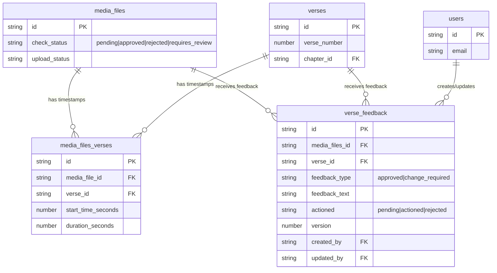

# Community Check Feature Implementation Plan

## Overview
Implement a comprehensive split-screen community check interface for reviewing audio files with detailed verse-by-verse feedback capabilities.

## Current State Analysis
- ❌ No existing community check functionality (clean slate)
- ✅ Audio player (`CornerAudioPlayer`) exists and can be referenced
- ✅ Audio files table (`AudioFileTable`) exists with styling patterns
- ✅ MediaFileWithVerseInfo and verse timestamp handling implemented
- ✅ Database schema includes `verse_feedback` table with proper relationships

## Database Schema (Already Implemented)

### verse_feedback table
The `verse_feedback` table already exists in the database with this structure:

```typescript
interface VerseFeedback {
  id: string;
  media_files_id: string;          // References media_files table directly
  verse_id: string;                // References verses table
  feedback_type: 'approved' | 'change_required';
  feedback_text: string | null;   // Optional text feedback
  actioned: 'pending' | 'actioned' | 'rejected';
  version: number;                 // Version tracking for feedback
  created_at: string | null;
  created_by: string | null;      // References users.id
  updated_at: string | null;
  updated_by: string | null;      // References users.id
}
```

### Existing tables to leverage:
- `media_files` - Has `check_status` field ('pending' | 'approved' | 'rejected' | 'requires_review')
- `media_files_verses` - Links media files to verse timestamps
- `verses` - Contains verse information and numbers

## Implementation Checklist

### Phase 1: Core Infrastructure & Types

- [x] **1.1: Create TypeScript interfaces** ✅ **COMPLETED**
  - File: `src/features/community-check/types/index.ts`
  - Add `VerseFeedback` interface matching database schema
  - Add `MediaFileWithFeedback` interface extending `MediaFileWithVerseInfo`
  - Add `VerseWithFeedback` interface for enhanced verse data with feedback
  - Add `CheckingMode` type: 'table' | 'checking'

- [x] **1.2: Create query hooks for verse feedback** ✅ **COMPLETED**
  - File: `src/shared/hooks/query/verse-feedback.ts`
  - `useVerseFeedbackByMediaFile(mediaFileId: string)` - fetch feedback for a media file
  - `useVerseFeedbackByVerse(verseId: string, mediaFileId: string)` - fetch feedback for specific verse
  - `useCreateVerseFeedback()` mutation - create new feedback
  - `useUpdateVerseFeedback()` mutation - update existing feedback
  - `useBulkApproveVerses()` mutation - bulk approve multiple verses
  - `useUpdateMediaFileCheckStatus()` mutation - update file's overall check_status

### Phase 2: Community Check Table Interface

- [x] **2.1: Create CommunityCheckTable component** ✅ **COMPLETED** *(Minor fixes needed)*
  - File: `src/features/community-check/components/CommunityCheckTable.tsx`
  - Display audio files with `check_status: 'pending'`
  - Style similar to AudioFileTable with proper columns
  - Actions: "Check" and "Publish" buttons only
  - Include filename, duration, uploader info, status
  - Support bulk selection for batch operations
  - *Note: Minor TypeScript type consistency needed between MediaFile and MediaFileWithVerseInfo*

- [x] **2.2: Create useCommunityChecking hook** ✅ **COMPLETED**
  - File: `src/features/community-check/hooks/useCommunityChecking.ts`
  - Filter media files by `check_status: 'pending'` and `upload_status: 'completed'`
  - Manage `selectedFileForChecking` state
  - Handle `handleStartChecking(file)` function
  - Handle `handlePublishFile(fileId)` function
  - Maintain bulk operations for approve/reject/review

### Phase 3: Split-Screen Layout & Navigation

- [x] **3.1: Create CheckingSplitView component** ✅ **COMPLETED**
  - Implemented directly within CommunityCheckPage component
  - Responsive grid layout: table on left (40%), player on right (60%)
  - Handle screen size breakpoints (stack vertically on mobile)
  - Back button to return to table view
  - Show current file info in header

- [x] **3.2: Create CommunityCheckPage component** ✅ **COMPLETED**
  - File: `src/features/community-check/pages/CommunityCheckPage.tsx`
  - Manage `checkingMode` state ('table' | 'checking')
  - Conditional rendering: table view vs split view
  - Pass selected file data to split view component
  - Handle navigation between modes
  - Integrated split-screen layout with placeholders for Phase 4-5 components

**Fixed Issues:**
- ✅ Resolved TypeScript type mismatch between MediaFile and MediaFileWithVerseInfo
- ✅ Replaced shared DataTable with custom table implementation following AudioFileTable pattern
- ✅ Added proper dark mode support throughout components

### Phase 4: Enhanced Audio Player for Checking

- [x] **4.1: Create CommunityCheckAudioPlayer component** ✅ **COMPLETED**
  - File: `src/features/community-check/components/CommunityCheckAudioPlayer/CommunityCheckAudioPlayer.tsx`
  - Base on existing `CornerAudioPlayer` but expand for full interface
  - Track name and verse reference header
  - Playback speed controls (0.5x, 0.75x, 1x, 1.25x, 1.5x, 2x)
  - Next/previous verse navigation with automatic jumping
  - Enhanced scrub bar with verse position indicators
  - Integrated into CommunityCheckPage with real-time verse tracking

- [ ] **4.2: Create CheckingAudioPlayerControls component** ⏭️ **SKIPPED**
  - *Combined with main component for better integration*

- [ ] **4.3: Create checking audio player store** ⏭️ **SKIPPED** 
  - *Using local state management for now, can be refactored later if needed*

**Enhanced Features Implemented:**
- ✅ Audio URL generation using download service with presigned URLs
- ✅ Real-time verse tracking and highlighting
- ✅ Current verse display in page header
- ✅ Verse-by-verse navigation with clickable verse numbers
- ✅ Full playback controls (play/pause, volume, speed adjustment)
- ✅ Visual verse grid navigation
- ✅ Progress bar with time display
- ✅ Error handling and loading states

### Phase 5: Verse Feedback Interface

- [x] **5.1: Create VerseWithFeedback component** ✅ **COMPLETED**
  - File: `src/features/community-check/components/CommunityCheckAudioPlayer/VerseWithFeedback.tsx`
  - Display verse number, timestamp, and current play status
  - Show existing feedback state with visual indicators
  - Text input for feedback notes with auto-save
  - Action buttons: "Approve", "Suggest Change", "View History"
  - Color-coded status indicators (green=approved, orange=needs change, gray=pending)

- [x] **5.2: Create VerseFeedbackList component** ✅ **COMPLETED**
  - File: `src/features/community-check/components/CommunityCheckAudioPlayer/VerseFeedbackList.tsx`
  - Scrollable list of all verses with individual feedback interfaces
  - Auto-scroll to currently playing verse
  - Bulk selection checkboxes for batch approval (planned for Phase 6)
  - Visual highlighting of current verse being played
  - Progress indicators showing feedback completion status

- [ ] **5.3: Create FeedbackHistoryModal component** ⏭️ **OPTIONAL**
  - *Feedback history is displayed inline within VerseWithFeedback component*
  - Expandable history section shows all versions with timestamps
  - Version comparison interface integrated into main component

**Enhanced Features Implemented:**
- ✅ Real-time verse feedback with visual status indicators
- ✅ Individual verse approval/rejection with one-click actions
- ✅ Feedback text input with auto-save capability
- ✅ Feedback history tracking with version control
- ✅ Visual feedback states (approved=green, changes required=orange, pending=gray)
- ✅ Current verse highlighting and auto-scroll
- ✅ Integrated verse jumping from feedback interface
- ✅ Responsive feedback interface with loading states
- ✅ Full CRUD operations for verse feedback

**Current State**: 
- Users can now view pending files in a table
- Click "Check" to enter split-screen checking mode
- Audio player with full controls and verse navigation
- Real-time verse feedback interface with individual verse approval/rejection
- Complete feedback workflow from table to detailed checking

### Phase 6: Bulk Operations & File Status Management

- [ ] **6.1: Create BulkVerseFeedbackActions component**
  - File: `src/features/community-check/components/BulkVerseFeedbackActions.tsx`
  - Bulk approve selected verses with single action
  - Bulk reject selected verses
  - Clear all feedback for selected verses
  - Progress indicators for bulk operations
  - Undo functionality for recent bulk actions

- [ ] **6.2: Create FileStatusActions component**
  - File: `src/features/community-check/components/FileStatusActions.tsx`
  - Bottom action bar for changing entire file `check_status`
  - Buttons: "Approve File", "Mark Pending", "Reject File", "Requires Review"
  - Confirmation dialogs with feedback summary
  - Show statistics: X verses approved, Y need changes, etc.

### Phase 7: Integration & State Management

- [ ] **7.1: Create useCommunityCheckingWorkflow hook**
  - File: `src/features/community-check/hooks/useCommunityCheckingWorkflow.ts`
  - Manage overall checking workflow state
  - Handle transitions between table and checking views
  - Coordinate audio player and feedback states
  - Auto-save functionality for feedback entries
  - Handle optimistic updates for better UX

- [ ] **7.2: Create CheckingWorkflowContext**
  - File: `src/features/community-check/context/CheckingWorkflowContext.tsx`
  - Provide checking state throughout component tree
  - Manage selected file, current verse, feedback state
  - Handle keyboard shortcuts (space for play/pause, arrows for navigation)
  - Centralized error handling and loading states

### Phase 8: UI/UX Enhancements

- [ ] **8.1: Implement keyboard shortcuts**
  - Space bar: Play/pause toggle
  - Left/Right arrows: Previous/next verse
  - Number keys 1-5: Set playback speed
  - A key: Approve current verse
  - S key: Suggest change for current verse
  - Tab: Navigate between feedback inputs
  - Enter: Submit feedback for current verse

- [ ] **8.2: Add comprehensive progress indicators**
  - Overall file checking progress (X of Y verses reviewed)
  - Verse feedback completion percentage
  - Visual feedback for completed vs pending verses
  - Summary statistics in header/sidebar
  - Color-coded progress bars

- [ ] **8.3: Implement responsive design**
  - Mobile-friendly layout (vertical stack instead of side-by-side)
  - Touch-friendly controls for mobile devices
  - Appropriate text sizing and touch targets
  - Collapsible sections for small screens
  - Optimized audio player controls for mobile

### Phase 9: Testing & Optimization

- [ ] **9.1: Write comprehensive unit tests**
  - Test verse feedback CRUD operations
  - Test audio player functionality and verse navigation
  - Test bulk operations and state management
  - Test keyboard shortcuts and accessibility

- [ ] **9.2: Performance optimization**
  - Implement proper memoization for large verse lists
  - Optimize re-renders in audio player components
  - Add loading states for all async operations
  - Implement proper error boundaries with recovery
  - Virtualize verse lists for chapters with 100+ verses

- [ ] **9.3: User acceptance testing**
  - Test complete checking workflow end-to-end
  - Verify all feedback scenarios work correctly
  - Test edge cases (no verses, network failures, large files)
  - Performance testing with chapters containing 100+ verses
  - Accessibility testing with screen readers

## Key Files to Create

### Directory Structure
```
src/features/community-check/
├── components/
│   ├── CheckingSplitView/
│   │   ├── CheckingSplitView.tsx
│   │   └── index.ts
│   ├── CommunityCheckTable.tsx
│   ├── CommunityCheckAudioPlayer/
│   │   ├── CommunityCheckAudioPlayer.tsx
│   │   ├── CheckingAudioPlayerControls.tsx
│   │   ├── VerseWithFeedback.tsx
│   │   ├── VerseFeedbackList.tsx
│   │   └── index.ts
│   ├── BulkVerseFeedbackActions.tsx
│   ├── FileStatusActions.tsx
│   ├── FeedbackHistoryModal.tsx
│   └── index.ts
├── hooks/
│   ├── useCommunityChecking.ts
│   ├── useCommunityCheckingWorkflow.ts
│   └── index.ts
├── stores/
│   └── checkingAudioPlayer.ts
├── context/
│   └── CheckingWorkflowContext.tsx
├── pages/
│   ├── CommunityCheckPage.tsx
│   └── index.ts
├── types/
│   └── index.ts
└── index.ts

src/shared/hooks/query/
└── verse-feedback.ts
```

## Database Relationships



## Technical Considerations

### State Management Strategy
- Use React Context for sharing checking workflow state across components
- Zustand store for audio player state (separate from corner player)
- React Query for server state with optimistic updates
- Local state for UI interactions (modals, selections)

### Performance Considerations
- Virtualize verse lists for chapters with 100+ verses
- Debounce feedback text input to avoid excessive API calls
- Implement proper cleanup for audio resources on component unmount
- Use React.memo for expensive re-renders
- Batch feedback updates for better performance

### Accessibility Requirements
- ARIA labels for all audio controls and feedback buttons
- Keyboard navigation support throughout interface
- Screen reader friendly feedback state announcements
- High contrast support for visual indicators
- Focus management for modal dialogs

### Error Handling Strategy
- Graceful handling of audio loading failures with retry options
- Retry mechanisms for failed feedback saves with exponential backoff
- Offline state detection and handling
- User-friendly error messages with actionable next steps
- Rollback functionality for failed bulk operations

## Success Criteria
- [ ] Users can view all pending check files in a clear, organized table
- [ ] Clicking "Check" opens intuitive split-screen interface
- [ ] Audio plays smoothly with precise verse-aware navigation
- [ ] Users can efficiently provide feedback on individual verses
- [ ] Bulk operations work reliably for multiple verse approval
- [ ] File status can be changed confidently after thorough review
- [ ] Interface is responsive and accessible across all devices
- [ ] Performance remains smooth even with large verse lists (50+ verses)
- [ ] Keyboard shortcuts enhance workflow efficiency
- [ ] Feedback history provides clear audit trail

## Timeline Estimate
- **Phase 1-2**: 2-3 days (Infrastructure & Table Interface)
- **Phase 3-4**: 3-4 days (Split Layout & Enhanced Audio Player)
- **Phase 5-6**: 4-5 days (Verse Feedback Interface & Bulk Operations)
- **Phase 7-8**: 3-4 days (Integration & UX Enhancements)
- **Phase 9**: 2-3 days (Testing & Optimization)

**Total Estimated Time**: 14-19 days

## Implementation Notes

### Leveraging Existing Code
- Reference `CornerAudioPlayer` for audio player patterns and verse navigation
- Use `AudioFileTable` styling patterns for consistent UI
- Leverage existing `useAudioPlayerStore` patterns for state management
- Reuse `MediaFileWithVerseInfo` types and `useMediaFilesVerseTimestamps` hooks

### Key Design Decisions
- **Direct relationship**: `verse_feedback` links directly to `media_files` and `verses` (not through `media_files_verses`)
- **Version tracking**: Each feedback entry has a version number for history
- **Separation of concerns**: File-level `check_status` separate from verse-level feedback
- **Optimistic updates**: UI updates immediately, with rollback on failure
- **Progressive enhancement**: Basic functionality first, advanced features layered on

### Database Query Patterns
```typescript
// Get all feedback for a media file
const feedback = await supabase
  .from('verse_feedback')
  .select(`
    *,
    verses(verse_number),
    users:created_by(email, display_name)
  `)
  .eq('media_files_id', mediaFileId)
  .order('version', { ascending: false });

// Get pending check files
const pendingFiles = await supabase
  .from('media_files')
  .select(`
    *,
    books(name),
    chapters(chapter_number),
    verses:start_verse_id(verse_number),
    users:created_by(email, display_name)
  `)
  .eq('check_status', 'pending')
  .eq('upload_status', 'completed');
``` 